# Percolator Protocol - Mermaid Diagrams

> Comprehensive visual documentation of the Percolator Protocol architecture, flows, and components

**Repository:** https://github.com/aeyakovenko/percolator  
**Local Path:** `/Users/an/anhsrepo/percolator/`

---

## Table of Contents

1. [Mindmap - Conceptual Overview](#1-mindmap---conceptual-overview)
2. [Architecture Diagram](#2-architecture-diagram---system-components)
3. [Two-Phase Execution Flow](#3-two-phase-execution-flow)
4. [Slab Matching Engine Flow](#4-slab-matching-engine-flow)
5. [Anti-Toxicity Mechanisms](#5-anti-toxicity-mechanisms)
6. [Memory Layout](#6-memory-layout---slab-state-10-mb)
7. [Liquidation Flow](#7-liquidation-flow)
8. [Complete Codebase Structure](#8-complete-codebase-structure)
9. [Program ID and Deployment](#9-program-id-and-deployment)
10. [Instruction Flow Architecture](#10-instruction-flow-architecture)
11. [Data Type Relationships](#11-data-type-relationships)
12. [Anti-Toxicity Implementation Details](#12-anti-toxicity-implementation-details)
13. [Memory Pool Management](#13-memory-pool-management-10-mb-budget)
14. [Testing Architecture](#14-testing-architecture)
15. [Risk Calculation Flow](#15-risk-calculation-flow)

---

## 1. Mindmap - Conceptual Overview

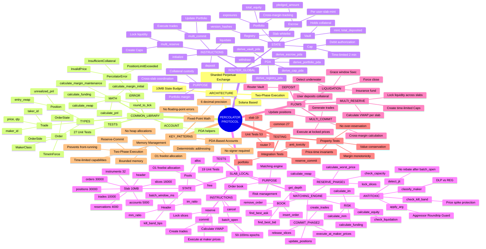

---

## 2. Architecture Diagram - System Components

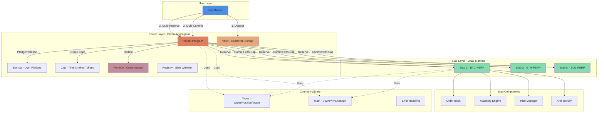

---

## 3. Two-Phase Execution Flow

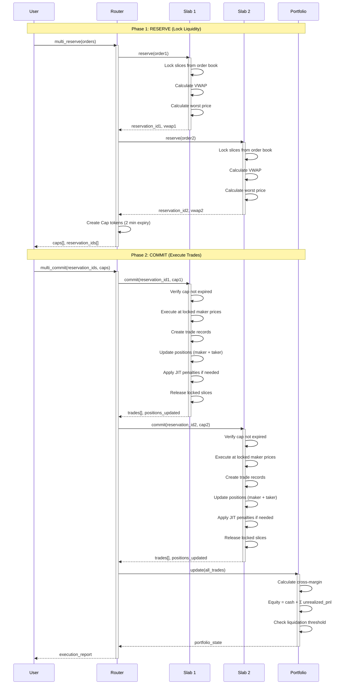

---

## 4. Slab Matching Engine Flow

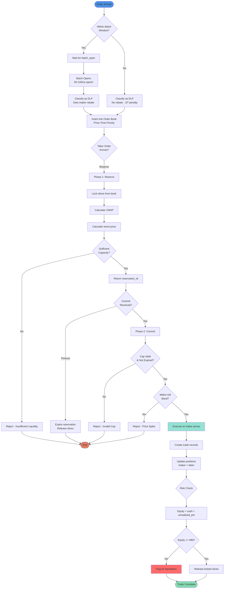

---

## 5. Anti-Toxicity Mechanisms

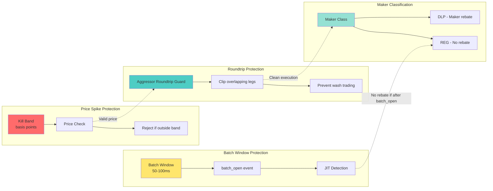

---

## 6. Memory Layout - Slab State (10 MB)

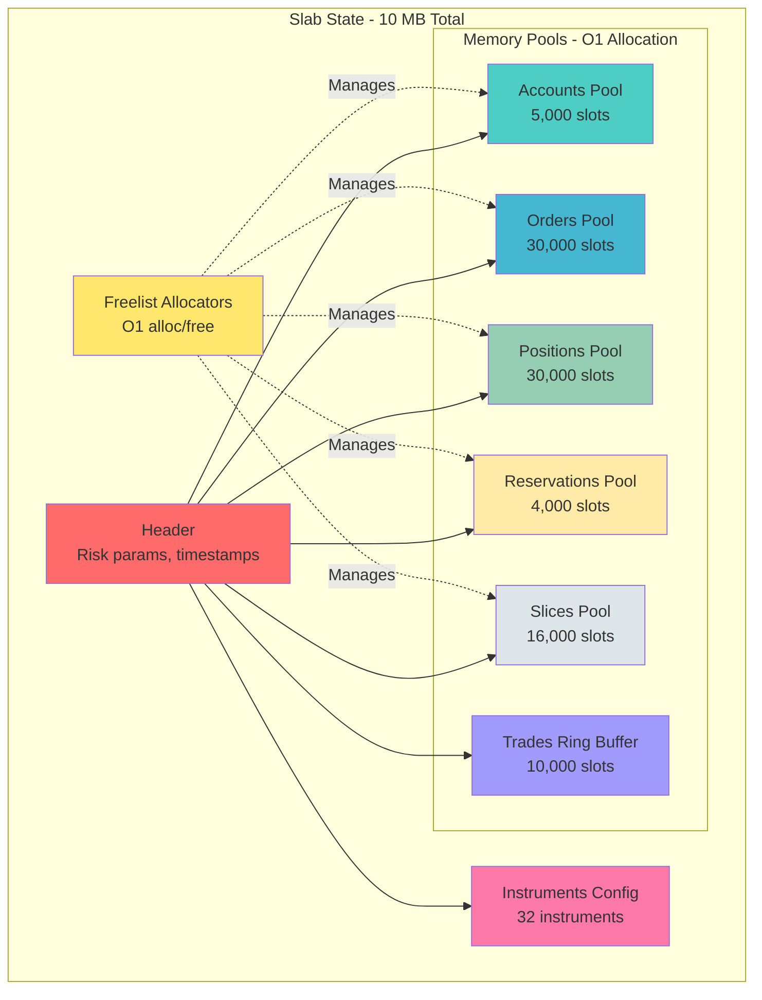

---

## 7. Liquidation Flow

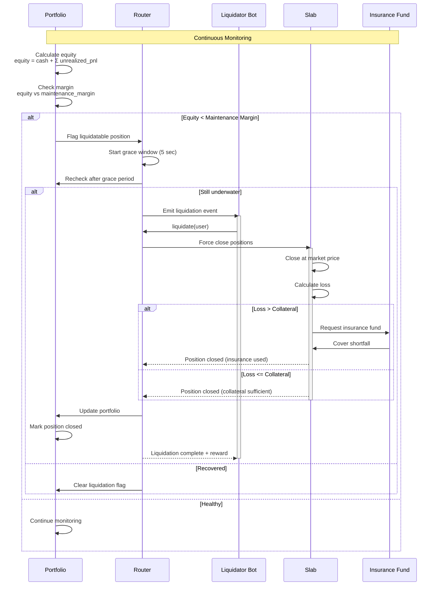

---

## 8. Complete Codebase Structure

```mermaid
graph TB
    subgraph Repository Root
        CT[Cargo.toml<br/>Workspace]
        CL[Cargo.lock]
        SP[Surfpool.toml<br/>Test Config]
        PM[plan.md<br/>Specification]
        RM[README.md]
        LIB[libintegration_reserve_commit.rlib]
    end
    
    subgraph programs/common
        CL1[lib.rs]
        CT1[types.rs<br/>Order/Position/Trade]
        CM1[math.rs<br/>VWAP/PnL/Margin]
        CE1[error.rs<br/>30+ Error Variants]
        CA1[account.rs<br/>PDA Helpers]
        CI1[instruction.rs<br/>Discriminators]
        CTst[tests.rs<br/>27 Unit Tests]
    end
    
    subgraph programs/router
        RL[lib.rs]
        RE[entrypoint.rs<br/>process_instruction]
        RP[pda.rs<br/>5 PDA Types]
        
        subgraph router/instructions
            RI1[initialize.rs]
            RI2[deposit.rs]
            RI3[withdraw.rs]
            RI4[multi_reserve.rs]
            RI5[multi_commit.rs]
            RI6[liquidate.rs]
            RIM[mod.rs<br/>Dispatcher]
        end
        
        subgraph router/state
            RS1[vault.rs<br/>Collateral Storage]
            RS2[escrow.rs<br/>User Pledges]
            RS3[cap.rs<br/>Time-Limited Tokens]
            RS4[portfolio.rs<br/>Cross-Margin]
            RS5[registry.rs<br/>Slab Whitelist]
            RSM[mod.rs<br/>State Traits]
        end
    end
    
    subgraph programs/slab
        SL[lib.rs]
        SE[entrypoint.rs<br/>process_instruction]
        SPD[pda.rs<br/>Slab PDA]
        
        subgraph slab/instructions
            SI1[reserve.rs<br/>Phase 1]
            SI2[commit.rs<br/>Phase 2]
            SI3[cancel.rs]
            SI4[batch_open.rs<br/>50-100ms Epochs]
            SIM[mod.rs<br/>Dispatcher]
        end
        
        subgraph slab/matching
            SM1[book.rs<br/>Order Book]
            SM2[reserve.rs<br/>Lock Slices]
            SM3[commit.rs<br/>Execute Trades]
            SM4[risk.rs<br/>Equity/IM/MM]
            SM5[antitoxic.rs<br/>JIT/Kill/ARG]
            SMM[mod.rs<br/>Engine Orchestrator]
        end
        
        subgraph slab/state
            SS1[slab.rs<br/>Main 10MB State]
            SS2[header.rs<br/>Risk Params]
            SS3[pools.rs<br/>O1 Freelists]
            SSM[mod.rs<br/>State Traits]
        end
        
        STst[tests.rs<br/>19 Unit Tests]
    end
    
    subgraph tests/
        T1[integration_reserve_commit.rs]
        T2[integration_portfolio.rs]
        T3[integration_anti_toxicity.rs]
        T4[property_invariants.rs]
        TREAD[README.md<br/>Test Strategy]
    end
    
    subgraph target/
        TD[debug/<br/>Build Artifacts]
        TL1[libpercolator_common.rlib]
        TL2[libpercolator_router.so]
        TL3[libpercolator_slab.so]
    end
    
    CT --> CL1
    CT --> RL
    CT --> SL
    
    CL1 --> CT1
    CL1 --> CM1
    CL1 --> CE1
    CL1 --> CA1
    CL1 --> CI1
    
    RL --> RE
    RL --> RP
    RL --> RIM
    RL --> RSM
    
    SL --> SE
    SL --> SPD
    SL --> SIM
    SL --> SMM
    SL --> SSM
    
    RIM --> RI1
    RIM --> RI2
    RIM --> RI3
    RIM --> RI4
    RIM --> RI5
    RIM --> RI6
    
    RSM --> RS1
    RSM --> RS2
    RSM --> RS3
    RSM --> RS4
    RSM --> RS5
    
    SIM --> SI1
    SIM --> SI2
    SIM --> SI3
    SIM --> SI4
    
    SMM --> SM1
    SMM --> SM2
    SMM --> SM3
    SMM --> SM4
    SMM --> SM5
    
    SSM --> SS1
    SSM --> SS2
    SSM --> SS3
    
    RL -.Uses.-> CL1
    SL -.Uses.-> CL1
    
    style CT fill:#FF6B6B
    style CL1 fill:#4ECDC4
    style RL fill:#E8A87C
    style SL fill:#95E1D3
    style RIM fill:#FFE66D
    style RSM fill:#A29BFE
    style SIM fill:#FFE66D
    style SMM fill:#FD79A8
    style SSM fill:#74B9FF
```

---

## 9. Program ID and Deployment

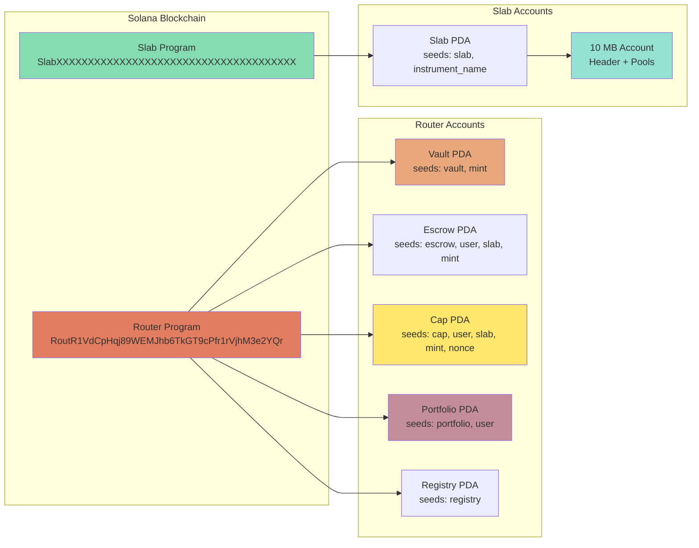

---

## 10. Instruction Flow Architecture

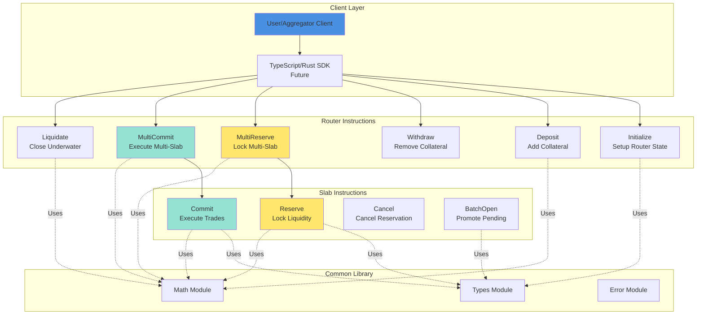

---

## 11. Data Type Relationships

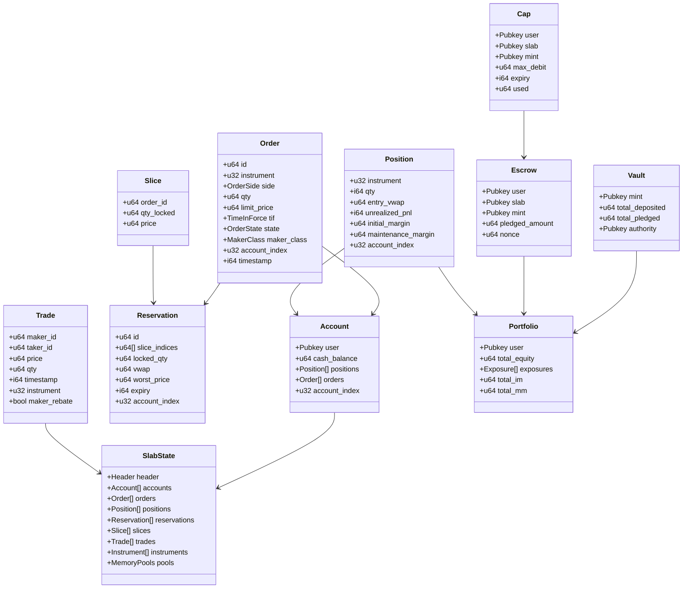

---

## 12. Anti-Toxicity Implementation Details

```mermaid
graph TB
    subgraph Batch Window Mechanism
        BW1[Time t=0<br/>Batch Starts]
        BW2[Orders Posted<br/>State: PENDING]
        BW3[t=50-100ms<br/>batch_open Event]
        BW4[Promote PENDING → LIVE<br/>Eligible for matching]
        BW5[Orders after batch_open<br/>Classified as REG<br/>No maker rebate]
    end
    
    subgraph Kill Band Protection
        KB1[Mark Price<br/>Reference]
        KB2[Order Price<br/>Incoming]
        KB3{|Price - Mark| ><br/>kill_band_bps?}
        KB4[Accept Order]
        KB5[Reject Order<br/>Price Spike]
    end
    
    subgraph Aggressor Roundtrip Guard ARG
        ARG1[Taker Order<br/>Multi-leg]
        ARG2{Same user has<br/>opposing position?}
        ARG3[Clip overlapping qty]
        ARG4[Tax roundtrip]
        ARG5[Execute reduced qty]
        ARG6[Execute full qty]
    end
    
    subgraph JIT Detection
        JIT1[Order Posted]
        JIT2{Posted before<br/>batch_open?}
        JIT3[DLP Class<br/>Gets rebate]
        JIT4[REG Class<br/>No rebate]
    end
    
    BW1 --> BW2
    BW2 --> BW3
    BW3 --> BW4
    BW3 --> BW5
    
    KB1 --> KB3
    KB2 --> KB3
    KB3 -->|No| KB4
    KB3 -->|Yes| KB5
    
    ARG1 --> ARG2
    ARG2 -->|Yes| ARG3
    ARG3 --> ARG4
    ARG4 --> ARG5
    ARG2 -->|No| ARG6
    
    JIT1 --> JIT2
    JIT2 -->|Yes| JIT3
    JIT2 -->|No| JIT4
    
    style BW3 fill:#FFE66D
    style KB5 fill:#FF6B6B
    style ARG3 fill:#FD79A8
    style JIT4 fill:#FF6B6B
```

---

## 13. Memory Pool Management (10 MB Budget)

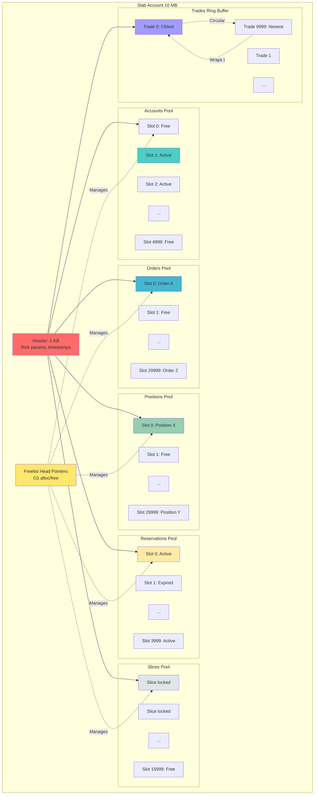

---

## 14. Testing Architecture

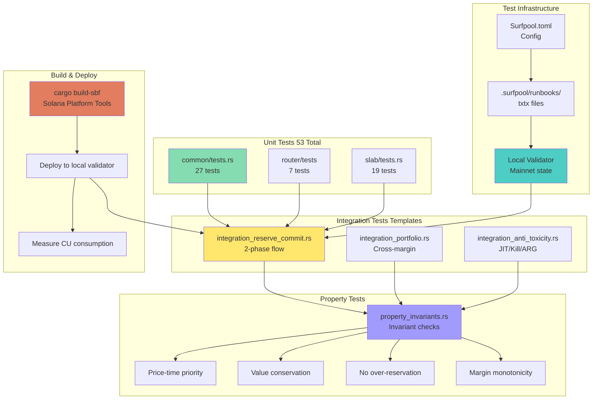

---

## 15. Risk Calculation Flow

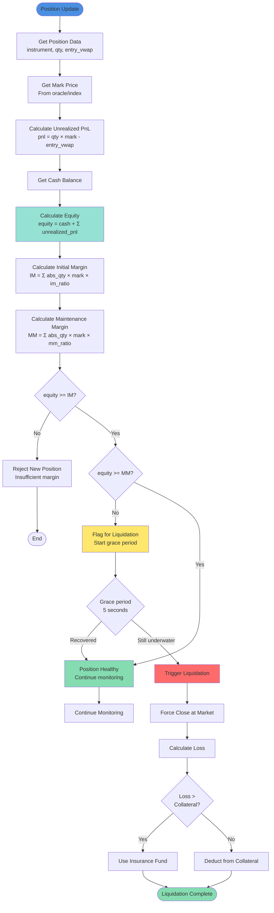

---

## Key Concepts Summary

### Two-Phase Execution
- **Phase 1 (Reserve)**: Lock liquidity, calculate VWAP, create time-limited capability tokens
- **Phase 2 (Commit)**: Execute at locked prices within 2-minute window

### Anti-Toxicity Protections
1. **Batch Windows**: 50-100ms epochs for fair order matching
2. **JIT Penalty**: Orders after `batch_open` get no maker rebate
3. **Kill Band**: Reject orders outside price spike threshold
4. **ARG**: Clip overlapping legs to prevent wash trading

### Memory Management
- **O(1) Freelist Allocation**: Deterministic, bounded memory
- **10 MB State Budget**: Enforced at compile-time
- **No Heap Allocations**: Pure stack-based execution

### Program IDs
- **Router**: `RoutR1VdCpHqj89WEMJhb6TkGT9cPfr1rVjhM3e2YQr`
- **Slab**: TBD (per deployment)

---

**Last Updated**: October 20, 2025  
**Source**: https://github.com/aeyakovenko/percolator

